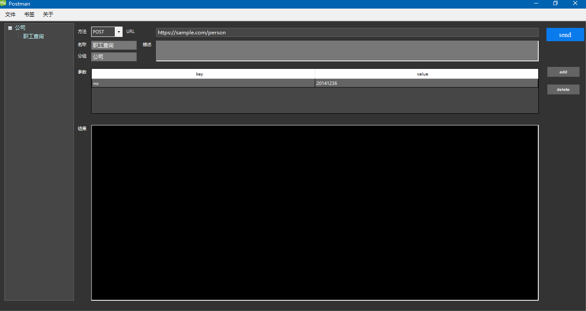

# PostMan

Postman是一个远程http方法调用工具，支持`post`,`get`，目前只支持json格式。

## 环境
- 系统: `Windows 7`
- 运行时: `.Net Framwork 4.5`
- IDE： `Visual Studio 2017`
## U用法
> 1) git clone https://github.com/xijiz/postman.git
> 2) cd src\Postman\Postman\bin\Release
> 3) Postman.exe