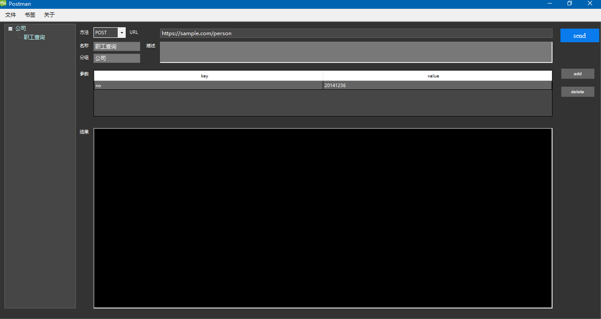

# PostMan 
## Introduce

Postman is a remote interface debuger for http method(post, get), which only support one data format - Json.

## Environment
- System: `Windows 7` or later
- Runtime: `.Net Framwork 4.5`
- IDE： `Visual Studio 2017`
## Usage
> 1) git clone https://github.com/CHENTsang/postman.git
> 2) cd src\Postman\Postman\bin\Release
> 3) Postman.exe